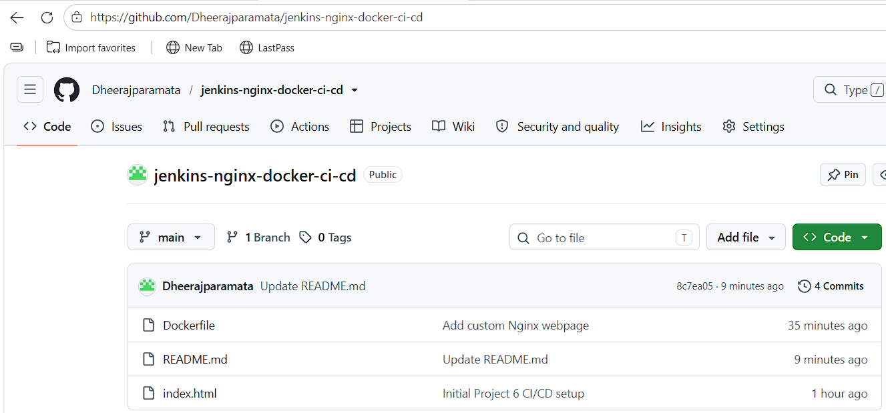
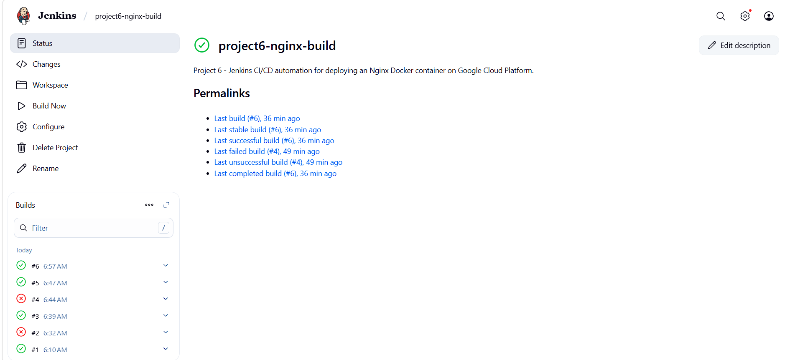
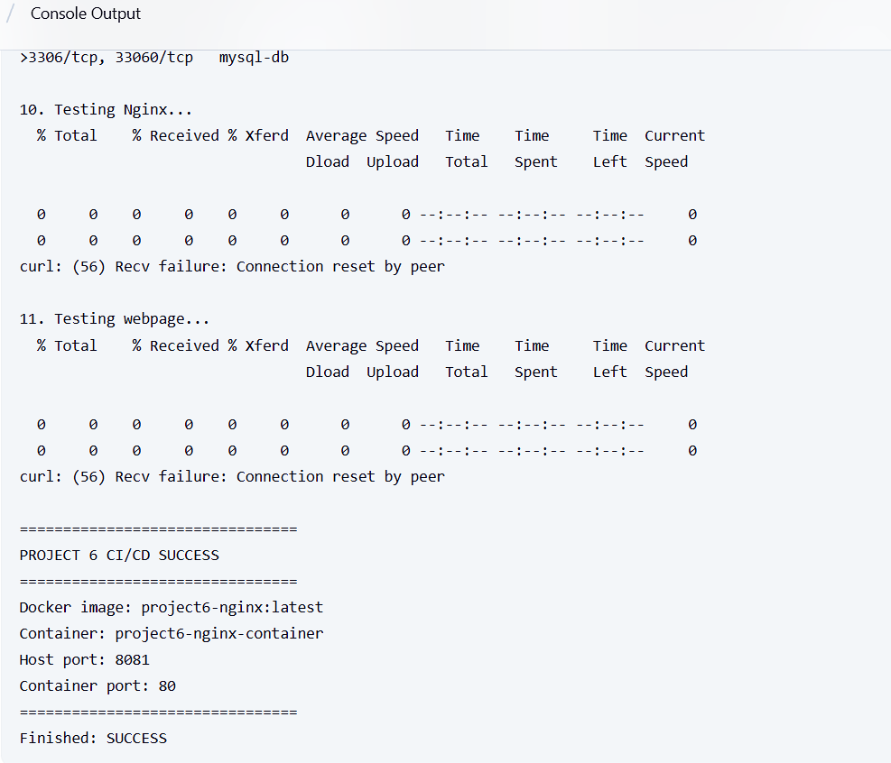
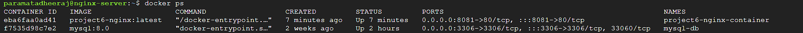
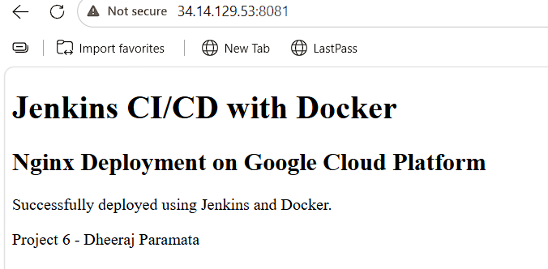
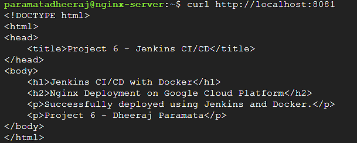

# Jenkins Nginx Docker CI/CD

Automating an Nginx web server deployment using Jenkins, Docker, GitHub, and Google Cloud Platform (GCP).

## Project Overview

This project demonstrates how to build and deploy an Nginx web server using Jenkins CI/CD and Docker on a Google Cloud Platform (GCP) Virtual Machine.

## Technologies Used

* Google Cloud Platform (GCP)
* Compute Engine
* Debian 12
* Jenkins
* Git
* GitHub
* Docker
* Nginx
* Linux

## Project Architecture

```text
GitHub Repository
      │
      ▼
Jenkins
      │
      ▼
Docker Image
      │
      ▼
Docker Container
      │
      ▼
Nginx Web Server
      │
      ▼
Google Cloud VM
      │
      ▼
Web Browser
```

## Commands Used

```bash
git --version
java -version
docker --version

docker build -t project6-nginx:latest .

docker rm -f project6-nginx-container || true

docker run -d \
  --name project6-nginx-container \
  -p 8081:80 \
  project6-nginx:latest

docker ps

curl http://localhost:8081
```

## Result

* Successfully connected GitHub repository with Jenkins.
* Successfully cloned project files from GitHub.
* Successfully built the Nginx Docker image.
* Successfully deployed the Nginx Docker container.
* Successfully replaced the previous container automatically.
* Successfully verified the custom webpage using curl.
* Successfully completed the Jenkins CI/CD build.
* Jenkins build finished with **SUCCESS**.
* Website deployed using HTTP on port **8081**.

## Screenshots
## Screenshots

### 1. GitHub Repository



### 2. Jenkins Job



### 3. Jenkins Console Output



### 4. Docker Container Running



### 5. Browser Output



### 6. curl localhost Output



## Author

**Dheeraj Paramata**
